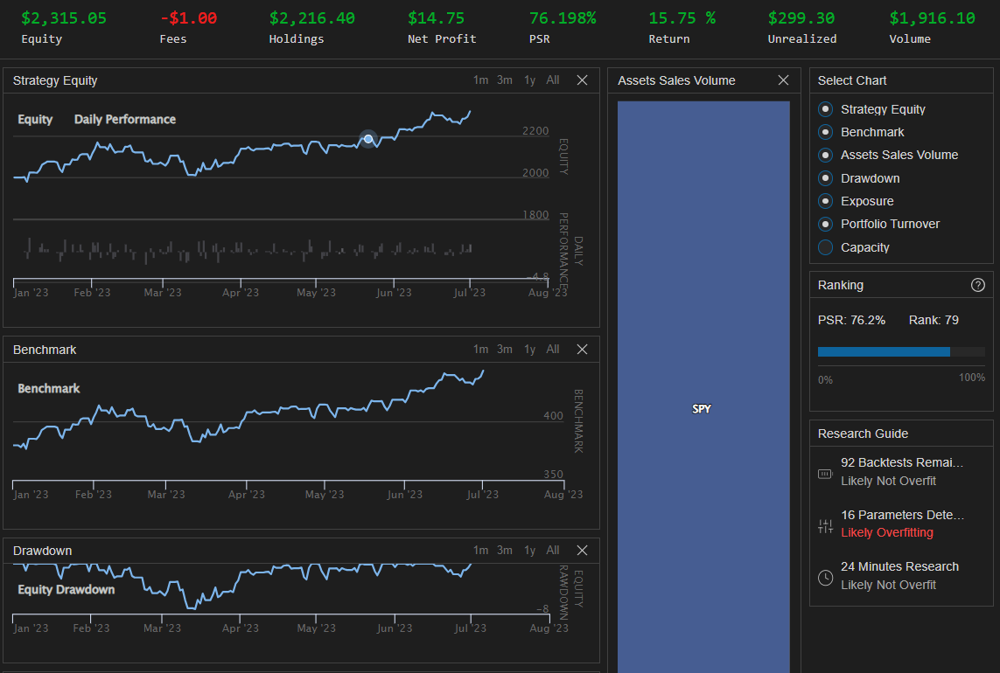

# ARIMA Buy And Hold SPY Algorithm

The ARIMABuyAndHoldSPY algorithm is a Buy and Hold strategy that dynamically determines "Take Profit" and "Stop Loss" targets based on ARIMA forecasts. This algorithm is designed to work with the SP500 index (SPY) and aims to optimize risk management and profitability by taking long positions in uptrends and short positions in downtrends.

## Strategy Description
The primary objective of this algorithm is to buy and hold the SP500 index (SPY) while using *ARIMA(p, d, q)* models to forecast future price movements. It takes advantage of the ARIMA model's ability to capture both trend and seasonality in the stock's price.

The algorithm follows the following steps:

1. **Initialization:** The algorithm sets the backtesting parameters, including the start and end dates, and the initial capital for the simulation. It also initializes basic algorithm settings, such as the entry price, the time frame for re-entry, and the benchmark to track performance against.

2. **Assessing Trend:** The algorithm assesses the trend of the stock based on the past 21-candle simple moving average (SMA) and the current stock price. If the current price is above the SMA, it is considered an "uptrend"; otherwise, it is a "downtrend."

3. **Finding Best ARIMA Model:** The algorithm searches for the best ARIMA(p, d, q) model based on the Bayesian Information Criterion (BIC). It iterates through a range of p, d, and q values and selects the model with the lowest BIC value.

4. **Performing ARIMA Forecast:** Using the best ARIMA model, the algorithm performs a 4-step ahead forecast on the closing price of the stock. It also computes the 80% confidence intervals for the forecasts.

5. **Setting Risk-Reward Targets:** The algorithm sets the "Take Profit" and "Stop Loss" thresholds based on the 80% confidence bounds of the 4th day of the forecast. If the stock is in an uptrend, the "Take Profit" is set as the upper confidence bound, and the "Stop Loss" as the lower confidence bound. For downtrends, it is the opposite.

6. **Buying and Selling Decisions:** If the algorithm is not already invested in the stock, it checks if it's time to invest. If so, it allocates 100% of the portfolio to SPY and sets the entry price. If already invested, it checks if the current price is outside the "Take Profit" or "Stop Loss" thresholds and takes appropriate long or short positions.

7. **Re-Entry Time:** After each buy or sell action, the algorithm sets the next entry time for 31 days later. It ensures that the algorithm stays in cash for this period before re-entering the market.

8. **Portfolio Value Logging:** The algorithm logs the current portfolio value after each trading decision, providing visibility into the performance.

## Getting Started

To use this algorithm, you need to import the required libraries and the AlgorithmImports module. The algorithm will work with the SP500 index (SPY) and uses the Interactive Brokers brokerage model. The backtesting parameters, such as the start and end dates, and the initial capital, can be modified to suit your needs.

## Backtesting

## Disclaimer
This algorithm is provided for educational and illustrative purposes only and does not constitute financial advice. It may not be suitable for live trading or investment purposes. Please perform your due diligence and seek professional advice before making any financial decisions.

Note: The code for this algorithm is provided for demonstration purposes only and may require additional modifications and testing before using it in live trading environments.
