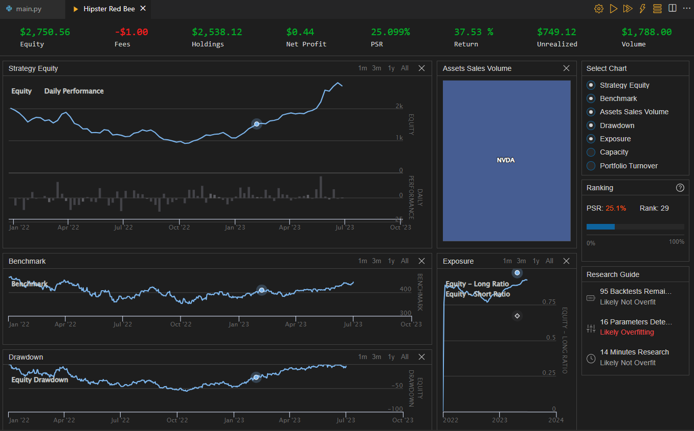

# Long-Short ARIMA Algorithm
The Long-Short ARIMA Algorithm is a dynamic trading strategy that uses the Autoregressive Integrated Moving Average (ARIMA) model to make long and short sell decisions on tradeable securities based on price trends and forecasted confidence bounds. The algorithm dynamically adjusts trading positions and sets take-profit and stop-loss thresholds based on the ARIMA forecast for the next 4 candles.

## Strategy Description
The algorithm follows the following steps:

1. **Initialization:** The algorithm sets the start and end dates for the backtest, defines the initial cash amount for simulation, and sets basic algorithm settings, including the entry price, time period (31 days), and the next entry time (initially set to the start date).

2. **Brokerage Model:** The algorithm specifies the brokerage model as InteractiveBrokersBrokerage and sets the account type to Margin, enabling the use of leverage if needed.

3. **Adding Security:** The algorithm adds a tradeable security (e.g., NVDA stock) as an equity security with a daily resolution. It also sets the data normalization mode to Raw, meaning no modifications will be made to the asset price (e.g., dividends will be paid in cash).

4. **Trend Assessment:** The algorithm assesses the trend of the tradeable security based on the past 21-candles Simple Moving Average (SMA) and the current stock price. If the current price is above the SMA, the trend is considered an "uptrend"; otherwise, it is considered a "downtrend."

5. **ARIMA Forecasting:** The algorithm uses historical close prices for the past 90 days to find the best ARIMA(p, d, q) model based on the Bayesian Information Criterion (BIC). It then makes a 4-step ahead forecast using the most optimal ARIMA model. The forecast is accompanied by 80% confidence bounds.

6. **Exit and Entry Logic:** If the algorithm is not already invested, it checks whether the current time is greater than or equal to the next entry time. If so, it buys the tradeable security with a 100% allocation to the portfolio. If the algorithm is already invested, it sets take-profit and stop-loss thresholds based on the 80% confidence bounds of the 4th day of the ARIMA forecast. If the current price goes beyond these thresholds, the algorithm either longs or shorts the tradeable security based on the trend and forecast.

7. **Stay in Cash:** After a buy or short sell decision is made, the algorithm sets the next entry time to 30 days ahead to ensure it stays in cash for that period.

8. **Portfolio Logging:** At the end of each OnData event, the algorithm logs the current portfolio value.

## Requirements
The algorithm uses the QuantConnect API and requires the following libraries and dependencies:

- `numpy`
- `statsmodels`
- `itertools`
- `datetime`
- `QuantConnect`

## Usage
To use the Long-Short ARIMA Algorithm for tradeable securities, simply copy the entire code and save it into a Python file with a ".py" extension. Then, execute the script in a QuantConnect environment or platform for backtesting or live trading with your chosen tradeable security's data.

## Backtesting

## Disclaimer and Risk Warning
This algorithm is for educational and informational purposes only. It is not intended as financial or investment advice. Trading in financial markets involves risk, including the potential loss of the entire investment. The Long-Short ARIMA Algorithm is considered a risky trading strategy because it relies on historical data and statistical models to make future price predictions. The accuracy of the ARIMA forecasts may vary depending on market conditions and the chosen security. Traders should exercise caution and perform thorough research before implementing this algorithm in live trading. Always consult with a qualified financial advisor or professional before making any investment decisions.
