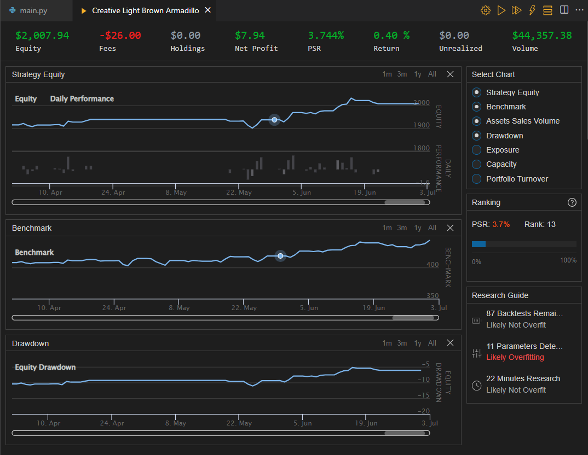

# Buy and Hold Algorithm with Dynamic Risk-Reward Targets

The Buy and Hold Algorithm with Dynamic Risk-Reward Targets is a modified version of a simple buy-and-hold strategy applied to the SP500 index (represented by the SPY ETF). The algorithm incorporates additional technical indicators, including the Average True Range (ATR), Relative Strength Index (RSI), and Simple Moving Average (SMA), to dynamically determine the "Stop Loss" and "Take Profit" targets.

## Strategy Description
The algorithm follows the following steps:

1. **Initialization:** The algorithm sets the start and end dates for the backtest, defines the initial cash amount for simulation, and sets basic algorithm settings such as the entry price, time period (31 days), and the next entry time (initially set to the start date).

2. **Brokerage Model:** The algorithm specifies the brokerage model as InteractiveBrokersBrokerage and sets the account type to Margin, enabling the use of leverage if needed.

3. **Adding Security:** The algorithm adds the SPY (SP500 ETF) as an equity security with a daily resolution. It also sets the data normalization mode to Raw, meaning no modifications will be made to the asset price (e.g., dividends will be paid in cash).

4. **Indicators:** The algorithm calculates three technical indicators for SPY: Average True Range (ATR), Relative Strength Index (RSI), and Simple Moving Average (SMA). The ATR measures market volatility, the RSI helps identify overbought or oversold conditions, and the SMA assists in determining the trend for entry points.

5. **Entry Logic:** If the current time is equal to or beyond the next entry time and the algorithm is not already invested, it checks whether the current price of SPY is above the SMA value, indicating an upward trend. If the conditions are met, the algorithm calculates the stop-loss and take-profit levels based on the ATR and sets the take-profit target at 2 times the ATR value above the current price to achieve a 1:2 risk-reward ratio.

6. **Buying SPY:** If the risk-reward ratio meets the 1:2 criteria, the algorithm buys SPY by setting holdings to 1, records the entry price, and sets the next entry time for the next period (31 days). It also logs this action.

7. **Exit Logic:** If the algorithm is already invested, it monitors whether the price of SPY reaches the stop-loss or take-profit levels. If either condition is met, the algorithm sells all SPY holdings and goes to cash. After the sale, the algorithm sets the next entry time for the next period and logs the action.

8. **Portfolio Logging:** At the end of each OnData event, the algorithm logs the current portfolio value.

## Requirements
The algorithm uses the QuantConnect API and requires the following libraries and dependencies:

- `numpy`
- `datetime`
- `QuantConnect`

## Usage
To use the Buy and Hold Algorithm with Dynamic Risk-Reward Targets, simply copy the entire code and save it into a Python file with a ".py" extension. Then, execute the script in a QuantConnect environment or platform for backtesting or live trading with SPY data.

## Backtesting

## Disclaimer
This algorithm is for educational and informational purposes only. It is not intended as financial or investment advice. Trading in financial markets involves risk, and past performance does not guarantee future results. Always conduct your research and consult with a qualified financial advisor before making any investment decisions.
