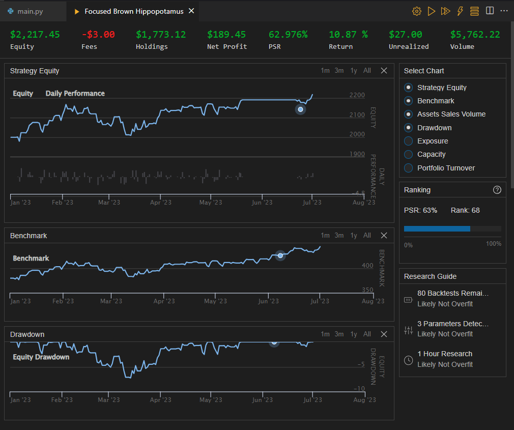

#  Buy and Hold SP500 Algorithm

The Buy and Hold SPY algorithm is a simple, rule-based trading strategy implemented using the QuantConnect API in Python. The primary goal of the algorithm is to execute a buy-and-hold approach for the SP500 index (represented by the SPY ETF) while implementing a dynamic exit strategy based on certain price conditions. The algorithm aims to achieve a long-term growth strategy by entering and exiting the market based on specific price thresholds.

## Overview
The algorithm works as follows:

1. **Initialization:** The algorithm sets the start and end dates for the backtest, defines the initial cash amount for simulation, and sets basic algorithm settings such as the entry price, time period (31 days), and the next entry time (initially set to the start date).

2. **Brokerage Model:** The algorithm specifies the brokerage model as InteractiveBrokersBrokerage and sets the account type to Margin. This allows the algorithm to use leverage for trading.

3. **Adding Security:** The algorithm adds the SPY (SP500 ETF) as an equity security with a daily resolution. It also sets the data normalization mode to Raw, meaning no modifications will be made to the asset price (e.g., dividends will be paid in cash).

4. **Entry Logic:** If the algorithm is not already invested in SPY and the current time is equal to or beyond the next entry time, it buys as much SPY as it can or allocates 100% of the portfolio to SPY, respectively. It records the entry price for future reference.

5. **Exit Logic:** If the algorithm is already invested in SPY, it checks whether the current price has deviated by 10% from the entry price. If either the price increases by 10% or decreases by 5%, it sells all SPY holdings and goes to cash. After the sale, the algorithm sets the next entry time for the next period (31 days).

6. **Portfolio Logging:** At the end of each OnData event, the algorithm logs the current portfolio value.

## Requirements
The algorithm uses the QuantConnect API and requires the following libraries and dependencies:

- `numpy`
- `datetime`
- `QuantConnect`

## Usage
To use the Simple Buy and Hold SP500 algorithm, simply copy the entire code and save it into a Python file with a ".py" extension. Then, execute the script in a QuantConnect environment or platform for backtesting or live trading with SPY data.

## Backtesting

## Disclaimer
This algorithm is for educational and informational purposes only. It is not intended as financial or investment advice. Trading in financial markets involves risk, and past performance does not guarantee future results. Always conduct your research and consult with a qualified financial advisor before making any investment decisions.